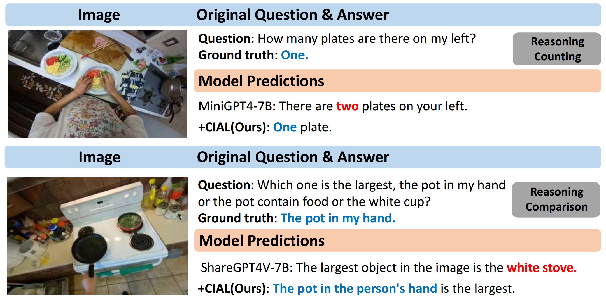

## Introduction

This is the source code of "Causal Intervention with Active Learning for Large Vision-Language Models in Egocentric Contexts"

## Causal Intervention with Active Learning for Large Vision-Language Models in Egocentric Contexts

The overall framework of the proposed CIAL method. (a) The causal model of Causal Intervention with Active Learning (CIAL). (b) The overall framework of the proposed model. It consists of two key components: Active Learning-Driven Knowledge Extraction (ALKE) and Knowledge-Guided Casual Intervention (KCI).


## Results


Comparative analysis between LVLM baselines and our proposed CIAL method in the Activity, Localization, Forecast, Reasoning and Object subsets. Incorrect descriptions are highlighted in red. Correct predictions are bolded in blue.





Comparisons with existing ten large vision-language models on the EgoThink benchmark, including Object (Existence, Attribute, Affordance), Activity, Localization (Location, Spatial Relationship), Reasoning (Counting, Comparison, Situated Reasoning) ,and Forecasting. Bolded values represent the best performance.


## Experiment

### Setup

Go to the GitHub of the relevant model to download the environment and pre-training files.

[LLaVA](https://github.com/haotian-liu/LLaVA): Please specify your downloaded checkpoint of llava in `models/test_llava_caption.py`.

[mPLUG-Owl and mPLUG-Owl2](https://github.com/X-PLUG/mPLUG-Owl): Please specify your downloaded checkpoint of mplug-owl in `models/test_mplug_owl_caption.py`.

[Otter](https://github.com/Luodian/Otter): Please specify your downloaded checkpoint of otter in `models/test_otter_image_caption.py`.

[PandaGPT](https://github.com/yxuansu/PandaGPT): Please specify your downloaded checkpoint of pandagpt in `models/test_pandagpt_caption.py`.

[MiniGPT4](https://github.com/Vision-CAIR/MiniGPT-4): Please specify your downloaded checkpoint of minigpt-4 in `models/minigpt4_legacy/minigpt4_eval.yaml` and the vicuna-7b or llama-7b path in `models/`minigpt4_legacy `/configs/models/minigpt4.yaml`.

[ShareGPT4V](https://github.com/ShareGPT4Omni/ShareGPT4V): Please specify your downloaded checkpoint of sharegpt4v in `models/test_llava_caption.py`.

### **Data**

You can download the images of EgoThink in [https://github.com/AdaCheng/EgoThink/tree/main/EgoThink](https://github.com/AdaCheng/EgoThink/tree/main/EgoThink). And put images under `data `folder.

### Knowledge Extraction

#### Internal knowledge

Download the project of [Grounding dino](https://github.com/IDEA-Research/Grounded-SAM-2) and put the grounded_ego.py under the Grounded-SAM-2 folder then run:

```
python grounded_ego.py
```

Please put the answer folder `clip_ego` in the FRUIT folder.

Take the llava model as an example, please specify your downloaded checkpoint of llava in `models/caption.py` and run:

```
python image_caption.py --model_name caption --type (Activity/Forecast/...) --batch_size 1 --device gpu-id
```

Please put the answer folder `captions` in the FRUIT folder, same with `clip_ego`.

#### External knowledge

For example, constructing a knowledge base using images in EgoThink.

Firstly, run all_image.py to collect all the 700 images into the folder all_image:

```
python all_image.py
```

Then, prepare captions for knowledge base, you can change and run image_caption.py to finish it. Put all the captions under ./labels/captions.jsonl

Next, run retrieve.py to generate external knowledge:

```
python retrieve.py
```

### Knowledge Selection

First, run knowledge_selection.py to select the internal knowledge:

```
python knowledge_selection.py
```

### Inference

First generate N answers using:

```
python eval.py --model_name Your model name --batch_size 1 --device gpu-id
```

Then using certainty socore to select the final answer: 

```
python certainty.py
```

### Evaluation

Add your openai api key in `common.py` in line 422 and run:

```
python gen_judgment.py --model-list Your model name --data_folder ./results --judge-model gpt-4  --bench-name (Activity/Forecast/...) --parallel 1 --mode single
```

### Show Results

Change path of your answer in `show_result.py` in line 173 and run:

```
python show_result.py
```

### Add new model

if you want to add new model:

1. create `test_{new_model}.py` in `/models`.
2. Then add the new model in `get_model()` in `/models/__init__.py`.

For example:

```sh
# BLIP2-7B
 if model_name == 'blip2-7b':
        from .test_blip2 import TestBlip2
        return TestBlip2(name='blip2_opt', model_type='pretrain_opt6.7b', config_path='/models/blip_configs/blip2_pretrain_opt6.7b.yaml', device=device)
```
